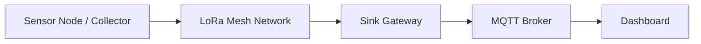
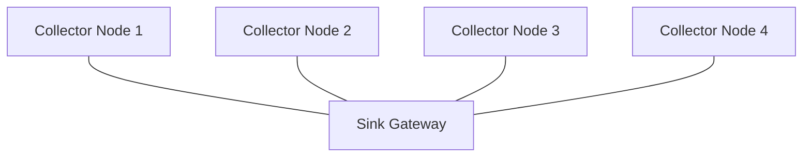
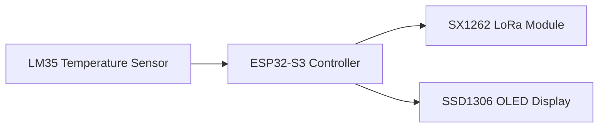

# 🚀 AAYA-MESH SYSTEM
### Distributed LoRa Mesh Telemetry Platform


AAYA-MESH is a **distributed long-range telemetry system** designed for **reliable environmental monitoring and sensor networking**.

The platform combines:
- LoRa mesh communication
- Edge sensor nodes
- Sink gateway architecture
- MQTT data streaming
- Web-based monitoring dashboards

Built for **low‑power**, **long‑range**, and **fault‑tolerant data transmission**.

---

# 🧠 System Architecture



---

# 🌐 Network Topology



---

# 🔧 Hardware Architecture



| Component | Description |
|---|---|
| ESP32-S3 | Main microcontroller |
| SX1262 | LoRa communication module |
| LM35 | Analog temperature sensor |
| SSD1306 OLED | System display |
| SPI Flash | SPIFFS storage |

---

# ⚙ Implemented Features

| # | Category | Feature | Description |
|---|---|---|---|
|1|Network|LoRa Mesh Communication|Long‑range node communication|
|2|Network|Multi‑node architecture|Multiple collectors supported|
|3|Reliability|ACK confirmation|Sender waits for ACK|
|4|Reliability|Packet retry|Automatic retransmission|
|5|Reliability|Duplicate protection|Avoid duplicate processing|
|6|Reliability|Checksum verification|Ensures packet integrity|
|7|Storage|Power‑cut safe queue|SPIFFS packet storage|
|8|Storage|Queue restore|Recover packets after reboot|
|9|Gateway|Sink gateway|Bridge LoRa → Internet|
|10|Gateway|MQTT communication|Publishes sensor data|
|11|Cloud|JSON payload|Structured sensor data|
|12|Hardware|LM35 sensor|Temperature sensing|
|13|Control|Remote commands|Sink → collector commands|
|14|System|Node roles|Sink and Collector modes|
|15|System|Modular firmware|Independent system modules|

---

# 📡 MQTT Data Format

Topic

```
mesh/node/{nodeID}/sensor
```

Example

```
mesh/node/c4ca/sensor
```

Payload

```json
{
 "node": "c4ca",
 "temperature": 25.5,
 "humidity": 60,
 "timestamp": 37538
}
```

---

# 🎥 System Demonstration

Replace `YOUR_VIDEO_ID` with your demo video.

[](https://youtu.be/YOUR_VIDEO_ID)

---

## 🖥 Boot Screen


---

## 📟 OLED Dashboard

- Device mode (Sink / Collector)
- Node ID
- System uptime
- Network status


---

# 🛠 Installation

### Install Required Libraries
- RadioLib
- Adafruit SSD1306
- PubSubClient
- ArduinoJson

### Flash Firmware
Upload firmware to:
- Collector nodes
- Sink gateway

### Start MQTT Broker
```
mosquitto -v
```

### Start Dashboard
```
node-red
```

Open dashboard:
```
http://localhost:1880/ui
```

---

# 📁 Project Structure

```
/src
 ├── PacketManager.cpp
 ├── LoRaManager.cpp
 ├── GatewayQueue.cpp
 ├── MQTTGateway.cpp
 ├── WiFiGateway.cpp
 ├── SensorModule.cpp
 ├── RoleController.cpp
 ├── DisplayManager.cpp
 ├── UIController.cpp
 └── ScreenRenderer.cpp
```

---

# 🌍 Applications
- Forest fire monitoring
- Smart agriculture
- Environmental monitoring
- Industrial telemetry
- Remote sensor networks

---

# 📜 License
MIT License

---

# 👨‍💻 Author

### ✦ Aadil Badhra

Creator of **AAYA‑MESH SYSTEM**
